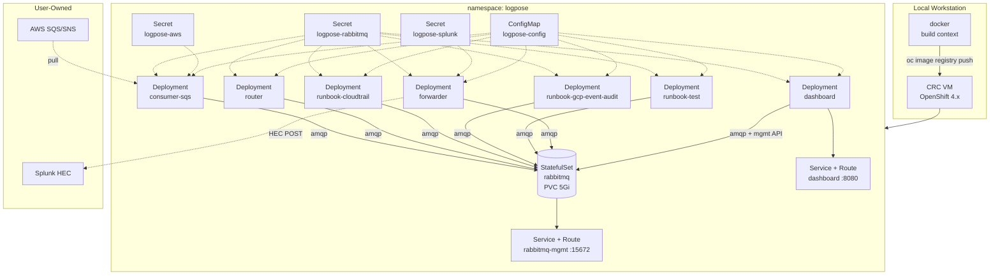

# LogPose — Local OpenShift Install Guide

This guide walks through a full, reproducible install of LogPose on a local
**CRC (CodeReady Containers)** cluster. Every command is copy-paste executable;
every manifest is inlined via `oc apply -f - <<'EOF'` so you never have to hunt
for files.

This guide deploys only the components that are implemented in the codebase
today: one **SQS consumer**, the **router**, the three real runbooks
(**CloudTrail**, **GCP Event Audit**, **Test**), the **Splunk forwarder**, and
the **dashboard**. The GuardDuty and EKS routes exist in the router but have no
runbook class yet and are intentionally out of scope here. For the full
architecture narrative, see the main [`README.md`](./README.md).

> **CloudTrail enricher pipeline.** The CloudTrail runbook now runs a full
> async enricher pipeline that makes live AWS API calls (CloudTrail
> `LookupEvents`, S3 `HeadObject`, IAM `GetUser`/`GetRole`, EC2
> `DescribeInstances`). The `logpose-runbook-cloudtrail` pod therefore requires
> AWS credentials at runtime — see section 7.3. Two optional env vars tune
> pipeline behaviour: `LOGPOSE_ENRICHER_TOTAL_BUDGET_SECONDS` (wall-clock cap
> per alert, default `8.0`) and `LOGPOSE_CACHE_STATS_INTERVAL` (how often the
> principal-cache hit-rate metric fires, default `50`).

---

## 1. Overview — What You'll Deploy



| Workload                  | Kind         | Replicas | Notes                                    |
|---------------------------|--------------|----------|------------------------------------------|
| `rabbitmq`                | StatefulSet  | 1        | 5Gi PVC at `/var/lib/rabbitmq`           |
| `logpose-consumer-sqs`    | Deployment   | 1        | Pulls from your AWS SQS queue            |
| `logpose-router`          | Deployment   | 1        | Reads `alerts`, fans out to runbooks     |
| `logpose-runbook-cloudtrail`     | Deployment   | 1 | Consumes `runbook.cloudtrail`; calls CloudTrail, S3, IAM, EC2 APIs |
| `logpose-runbook-gcp-event-audit`| Deployment   | 1 | Consumes `runbook.gcp.event_audit`     |
| `logpose-runbook-test`           | Deployment   | 1 | Consumes `runbook.test` (smoke tests)  |
| `logpose-forwarder`       | Deployment   | 1        | Drains `enriched` + `alerts.dlq` to Splunk |
| `logpose-dashboard`       | Deployment   | 1        | Exposed via `Route` on port 8080         |

Every pod depends on RabbitMQ, so the StatefulSet is installed first.

---

## 2. Prerequisites

| Tool / Resource      | Version / Requirement                                               |
|----------------------|---------------------------------------------------------------------|
| CRC                  | 2.40+ (from Red Hat's CRC downloads page)                            |
| `oc` CLI             | 4.15+ (bundled with CRC via `crc oc-env`)                           |
| `docker`             | 24.0+ — used to build and push the image locally                    |
| CRC resources        | **6 vCPU, 16 GiB RAM, 60 GiB disk** (8 pods + RabbitMQ PVC)         |
| AWS SQS queue        | Queue URL + IAM access key / secret with `sqs:ReceiveMessage`, `sqs:DeleteMessage` |
| AWS enricher perms   | Same or separate IAM credential with `cloudtrail:LookupEvents`, `s3:HeadObject`, `iam:GetUser`, `iam:GetRole`, `ec2:DescribeInstances` — used by the CloudTrail runbook pod |
| Splunk HEC endpoint  | HEC URL + token; target index pre-created                           |
| Splunk sourcetypes   | `logpose:enriched_alert` and `logpose:dlq_alert` configured         |

Everything below assumes you already have AWS creds that can read from your
SQS queue and a working Splunk HEC token — provisioning those is out of scope.

---

## 3. Start CRC and Log In

```bash
crc config set cpus 6
crc config set memory 16384
crc config set disk-size 60

crc setup
crc start

# Put oc on PATH and log in as kubeadmin
eval $(crc oc-env)
oc login -u kubeadmin \
  -p "$(crc console --credentials | grep kubeadmin | awk '{print $4}')" \
  https://api.crc.testing:6443

oc new-project logpose
```

---

## 4. Build & Push the Image to the Internal Registry

CRC ships with the OpenShift internal image registry. Build the LogPose image
from the repo's `Dockerfile` and push it there so every Deployment can pull it.

CRC's internal registry uses a self-signed certificate, so Docker must be
configured to treat it as an insecure registry before the push will succeed.
Add the registry host to `/etc/docker/daemon.json` (create the file if it
doesn't exist) and restart the Docker daemon:

```json
{
  "insecure-registries": ["default-route-openshift-image-registry.apps-crc.testing"]
}
```

On macOS/Windows, set this via Docker Desktop → Settings → Docker Engine, then
**Apply & Restart**. On Linux, edit the file and `sudo systemctl restart docker`.

```bash
# From the repo root (directory containing the Dockerfile)
HOST=$(oc registry info)

# Authenticate Docker to the OpenShift internal registry using the current oc
# token. --password-stdin avoids leaking the token into shell history or the
# process list (the -p flag is deprecated for this reason).
oc whoami -t | docker login --username "$(oc whoami)" --password-stdin "$HOST"

# Build and push in a single step with buildx. --platform linux/amd64 ensures
# the image runs on the CRC node even when building from Apple Silicon /
# non-amd64 hosts. --push streams the image directly to the registry
# (equivalent to --output=type=registry) so no separate `docker push` is needed.

docker buildx build \
  --platform linux/amd64 \
  --provenance=false \
  --sbom=false \
  --tag "$HOST/logpose/logpose:latest" \
  --push \
  .
```

All Deployments below reference the image at the cluster-internal DNS name:

```
image-registry.openshift-image-registry.svc:5000/logpose/logpose:latest
```

---

## 5. Create Secrets and the Shared ConfigMap

Replace the bracketed placeholders with your real values. Pick a strong
`RABBITMQ_PASS` — the same value is used inside `RABBITMQ_URL`, in
`RABBITMQ_PASS`, and in the `rabbitmq` StatefulSet's default-user env.

```bash
# Shared RabbitMQ credentials — consumed by every LogPose pod.
# RABBITMQ_USER / RABBITMQ_PASS are also read by the dashboard for the
# Management API (see logpose/dashboard/rabbitmq_api.py).
oc create secret generic logpose-rabbitmq \
  --from-literal=RABBITMQ_URL='amqp://logpose:<RABBIT-PASS>@rabbitmq:5672/' \
  --from-literal=RABBITMQ_MGMT_URL='http://rabbitmq:15672' \
  --from-literal=RABBITMQ_USER='logpose' \
  --from-literal=RABBITMQ_PASS='<RABBIT-PASS>'

# AWS credentials — consumed only by the SQS consumer.
oc create secret generic logpose-aws \
  --from-literal=AWS_ACCESS_KEY_ID='<AWS-KEY>' \
  --from-literal=AWS_SECRET_ACCESS_KEY='<AWS-SECRET>' \
  --from-literal=AWS_REGION='us-east-1' \
  --from-literal=SQS_QUEUE_URL='https://sqs.us-east-1.amazonaws.com/<ACCT>/<QUEUE>'

# Splunk HEC — consumed only by the forwarder.
oc create secret generic logpose-splunk \
  --from-literal=SPLUNK_HEC_URL='https://<SPLUNK-HOST>:8088/services/collector' \
  --from-literal=SPLUNK_HEC_TOKEN='<HEC-TOKEN>' \
  --from-literal=SPLUNK_INDEX='main'

# Non-secret shared config.
oc create configmap logpose-config \
  --from-literal=SPLUNK_BATCH_SIZE='50' \
  --from-literal=METRICS_DB_PATH='/tmp/logpose_metrics.db' \
  --from-literal=DASHBOARD_HOST='0.0.0.0' \
  --from-literal=DASHBOARD_PORT='8080'
```

---

## 6. Deploy RabbitMQ (Install This First)

A single `oc apply` creates the default-user secret, a headless Service, and a
StatefulSet with a 5Gi PVC. The healthcheck mirrors the `docker-compose.yml`
setup — `rabbitmq-diagnostics ping`.

```bash
oc apply -f - <<'EOF'
apiVersion: v1
kind: Secret
metadata:
  name: rabbitmq-default-user
type: Opaque
stringData:
  # Must match the password embedded in logpose-rabbitmq.RABBITMQ_URL.
  RABBITMQ_DEFAULT_USER: logpose
  RABBITMQ_DEFAULT_PASS: <RABBIT-PASS>
---
apiVersion: v1
kind: Service
metadata:
  name: rabbitmq
spec:
  clusterIP: None
  selector:
    app: rabbitmq
  ports:
  - name: amqp
    port: 5672
    targetPort: 5672
  - name: mgmt
    port: 15672
    targetPort: 15672
---
apiVersion: apps/v1
kind: StatefulSet
metadata:
  name: rabbitmq
spec:
  serviceName: rabbitmq
  replicas: 1
  selector:
    matchLabels:
      app: rabbitmq
  template:
    metadata:
      labels:
        app: rabbitmq
    spec:
      containers:
      - name: rabbitmq
        image: rabbitmq:3-management
        ports:
        - containerPort: 5672
          name: amqp
        - containerPort: 15672
          name: mgmt
        envFrom:
        - secretRef:
            name: rabbitmq-default-user
        volumeMounts:
        - name: data
          mountPath: /var/lib/rabbitmq
        readinessProbe:
          exec:
            command: ["rabbitmq-diagnostics", "ping"]
          initialDelaySeconds: 15
          periodSeconds: 10
        livenessProbe:
          exec:
            command: ["rabbitmq-diagnostics", "ping"]
          initialDelaySeconds: 30
          periodSeconds: 30
  volumeClaimTemplates:
  - metadata:
      name: data
    spec:
      accessModes: ["ReadWriteOnce"]
      resources:
        requests:
          storage: 5Gi
EOF

oc rollout status statefulset/rabbitmq --timeout=180s
```

---

## 7. Deploy the LogPose Workloads

Every workload uses the same image and differs only in `command` and the set
of Secrets/ConfigMaps it mounts. All blocks below target
`namespace: logpose`.

### 7.1 SQS Consumer

```bash
oc apply -f - <<'EOF'
apiVersion: apps/v1
kind: Deployment
metadata:
  name: logpose-consumer-sqs
spec:
  replicas: 1
  selector: {matchLabels: {app: logpose-consumer-sqs}}
  template:
    metadata: {labels: {app: logpose-consumer-sqs}}
    spec:
      containers:
      - name: logpose
        image: image-registry.openshift-image-registry.svc:5000/logpose/logpose:latest
        command:
        - python
        - -c
        - |
          from logpose.consumers import SqsConsumer
          from logpose.queue.rabbitmq import RabbitMQPublisher
          c = SqsConsumer(); p = RabbitMQPublisher()
          with c, p:
              c.consume(p.publish)
        envFrom:
        - secretRef: {name: logpose-rabbitmq}
        - secretRef: {name: logpose-aws}
        - configMapRef: {name: logpose-config}
EOF
```

### 7.2 Router

```bash
oc apply -f - <<'EOF'
apiVersion: apps/v1
kind: Deployment
metadata:
  name: logpose-router
spec:
  replicas: 1
  selector: {matchLabels: {app: logpose-router}}
  template:
    metadata: {labels: {app: logpose-router}}
    spec:
      containers:
      - name: logpose
        image: image-registry.openshift-image-registry.svc:5000/logpose/logpose:latest
        command: ["python", "-m", "logpose.router_main"]
        envFrom:
        - secretRef: {name: logpose-rabbitmq}
        - configMapRef: {name: logpose-config}
EOF
```

### 7.3 Runbook — CloudTrail

The CloudTrail runbook runs the full enricher pipeline and makes live AWS API
calls. It must receive AWS credentials with the enricher permissions listed in
the Prerequisites.

```bash
oc apply -f - <<'EOF'
apiVersion: apps/v1
kind: Deployment
metadata:
  name: logpose-runbook-cloudtrail
spec:
  replicas: 1
  selector: {matchLabels: {app: logpose-runbook-cloudtrail}}
  template:
    metadata: {labels: {app: logpose-runbook-cloudtrail}}
    spec:
      containers:
      - name: logpose
        image: image-registry.openshift-image-registry.svc:5000/logpose/logpose:latest
        command: ["python", "-m", "logpose.runbooks.cloud.aws.cloudtrail"]
        envFrom:
        - secretRef: {name: logpose-rabbitmq}
        - secretRef: {name: logpose-aws}
        - configMapRef: {name: logpose-config}
EOF
```

### 7.4 Runbook — GCP Event Audit

```bash
oc apply -f - <<'EOF'
apiVersion: apps/v1
kind: Deployment
metadata:
  name: logpose-runbook-gcp-event-audit
spec:
  replicas: 1
  selector: {matchLabels: {app: logpose-runbook-gcp-event-audit}}
  template:
    metadata: {labels: {app: logpose-runbook-gcp-event-audit}}
    spec:
      containers:
      - name: logpose
        image: image-registry.openshift-image-registry.svc:5000/logpose/logpose:latest
        command: ["python", "-m", "logpose.runbooks.cloud.gcp.event_audit"]
        envFrom:
        - secretRef: {name: logpose-rabbitmq}
        - configMapRef: {name: logpose-config}
EOF
```

### 7.5 Runbook — Test (smoke-test sink)

`test_runbook.py` does not define a `__main__` block, so start it by
importing the class and calling `.run()` inline.

```bash
oc apply -f - <<'EOF'
apiVersion: apps/v1
kind: Deployment
metadata:
  name: logpose-runbook-test
spec:
  replicas: 1
  selector: {matchLabels: {app: logpose-runbook-test}}
  template:
    metadata: {labels: {app: logpose-runbook-test}}
    spec:
      containers:
      - name: logpose
        image: image-registry.openshift-image-registry.svc:5000/logpose/logpose:latest
        command:
        - python
        - -c
        - |
          from logpose.runbooks.test_runbook import TestRunbook
          rb = TestRunbook()
          with rb:
              rb.run()
        envFrom:
        - secretRef: {name: logpose-rabbitmq}
        - configMapRef: {name: logpose-config}
EOF
```

### 7.6 Forwarder

```bash
oc apply -f - <<'EOF'
apiVersion: apps/v1
kind: Deployment
metadata:
  name: logpose-forwarder
spec:
  replicas: 1
  selector: {matchLabels: {app: logpose-forwarder}}
  template:
    metadata: {labels: {app: logpose-forwarder}}
    spec:
      containers:
      - name: logpose
        image: image-registry.openshift-image-registry.svc:5000/logpose/logpose:latest
        command: ["python", "-m", "logpose.forwarder_main"]
        envFrom:
        - secretRef: {name: logpose-rabbitmq}
        - secretRef: {name: logpose-splunk}
        - configMapRef: {name: logpose-config}
EOF
```

### 7.7 Dashboard (Deployment + Service + Route)

```bash
oc apply -f - <<'EOF'
apiVersion: apps/v1
kind: Deployment
metadata:
  name: logpose-dashboard
spec:
  replicas: 1
  selector: {matchLabels: {app: logpose-dashboard}}
  template:
    metadata: {labels: {app: logpose-dashboard}}
    spec:
      containers:
      - name: logpose
        image: image-registry.openshift-image-registry.svc:5000/logpose/logpose:latest
        command: ["python", "-m", "logpose.dashboard_main"]
        ports:
        - containerPort: 8080
        envFrom:
        - secretRef: {name: logpose-rabbitmq}
        - configMapRef: {name: logpose-config}
---
apiVersion: v1
kind: Service
metadata:
  name: logpose-dashboard
spec:
  selector:
    app: logpose-dashboard
  ports:
  - port: 8080
    targetPort: 8080
EOF

oc expose svc/logpose-dashboard
oc get route logpose-dashboard -o jsonpath='{.spec.host}{"\n"}'
# Expected output pattern: logpose-dashboard-logpose.apps-crc.testing
```

### 7.8 (Optional) Expose the RabbitMQ Management UI

Handy for watching queue depths during the demo. Use the `RABBITMQ_USER` /
`RABBITMQ_PASS` values from `logpose-rabbitmq` to log in.

```bash
oc expose svc/rabbitmq --port=15672 --name=rabbitmq-mgmt
oc get route rabbitmq-mgmt -o jsonpath='{.spec.host}{"\n"}'
```

---

## 8. Verification

Run these in order. Each step should pass before moving to the next.

1. **All 8 pods are `Running`.**

   ```bash
   oc get pods
   ```

   Expect one `rabbitmq-0` plus seven `logpose-*` pods, all `1/1 Running`.

2. **Router registered all five routes.**

   ```bash
   oc logs deploy/logpose-router | grep "Registered routes"
   ```

   Expect all five routes: `test`, `cloud.aws.cloudtrail`, `cloud.aws.guardduty`,
   `cloud.aws.eks`, and `cloud.gcp.event_audit`. (GuardDuty and EKS routes are
   registered by the router but no runbook pods consume those queues in this
   install — unmatched alerts for those routes will queue until a runbook is deployed.)

3. **Dashboard shows all expected queues.**

   Open the Route URL from step 7.7. The queue depth table should include
   `alerts`, `alerts.dlq`, `enriched`, `runbook.cloudtrail`,
   `runbook.gcp.event_audit`, and `runbook.test`.

4. **Inject a smoke-test alert via AWS CLI.**

   The `TestRunbook` route matches any payload with `"_logpose_test": true`
   (see `logpose/routing/routes/test_route.py`).

   ```bash
   aws sqs send-message \
     --queue-url "$SQS_QUEUE_URL" \
     --message-body '{"_logpose_test": true, "hello": "logpose"}'
   ```

5. **Confirm end-to-end flow.**

   - In the dashboard, watch the `runbook_success` counter increment.
   - In Splunk, search:

     ```
     index=main sourcetype=logpose:enriched_alert "_logpose_test"
     ```

     The smoke-test alert should land within a few seconds.

6. **DLQ check.** Send a payload that matches no route:

   ```bash
   aws sqs send-message \
     --queue-url "$SQS_QUEUE_URL" \
     --message-body '{"unmatched": "payload"}'
   ```

   The message should appear in the dashboard's `alerts.dlq` counter and in
   Splunk under `sourcetype=logpose:dlq_alert`.

---

## 9. Troubleshooting

| Symptom                                                  | Fix                                                                                     |
|----------------------------------------------------------|-----------------------------------------------------------------------------------------|
| Pods stuck `ImagePullBackOff`                            | `oc policy add-role-to-user system:image-puller system:serviceaccount:logpose:default -n logpose` |
| `rabbitmq-0` `CrashLoopBackOff`                          | Check the PVC bound: `oc get pvc` — unbound PVC means no default storage class in CRC.  |
| SQS consumer logs `AccessDenied` / `InvalidClientToken`  | Verify the four keys in the `logpose-aws` secret; rotate IAM creds if needed.           |
| Forwarder logs TLS errors to Splunk                      | CRC's VM may need a corporate proxy/CA bundle — see Red Hat's CRC proxy documentation. |
| Dashboard shows 0 queues                                 | Management API creds mismatch — compare `RABBITMQ_USER`/`RABBITMQ_PASS` in `logpose-rabbitmq` against `rabbitmq-default-user`. |
| Runbook never consumes                                   | `oc logs deploy/logpose-router` — confirm the route is registered; empty list means the `logpose.routing.routes` import failed. |

---

## 10. Teardown

```bash
oc delete project logpose
crc stop
# Fully remove the CRC VM (optional)
crc delete
```
